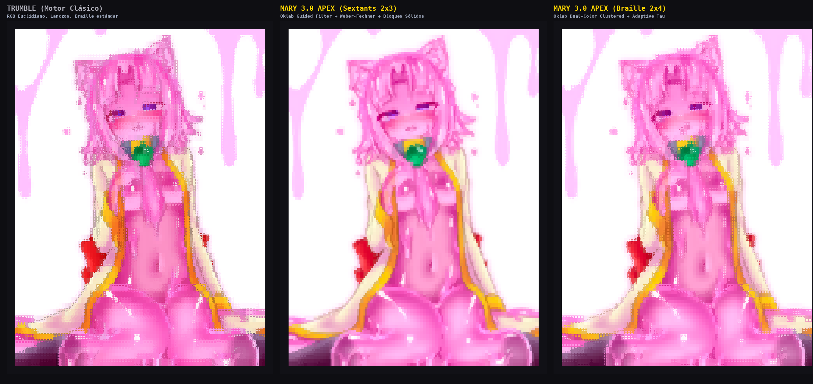
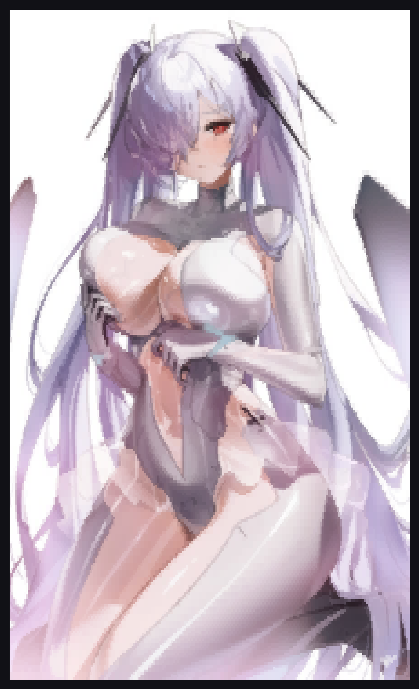
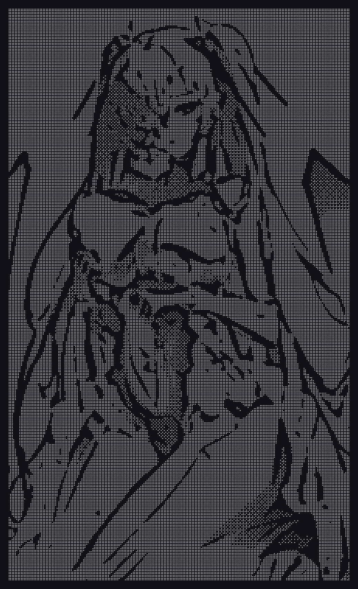
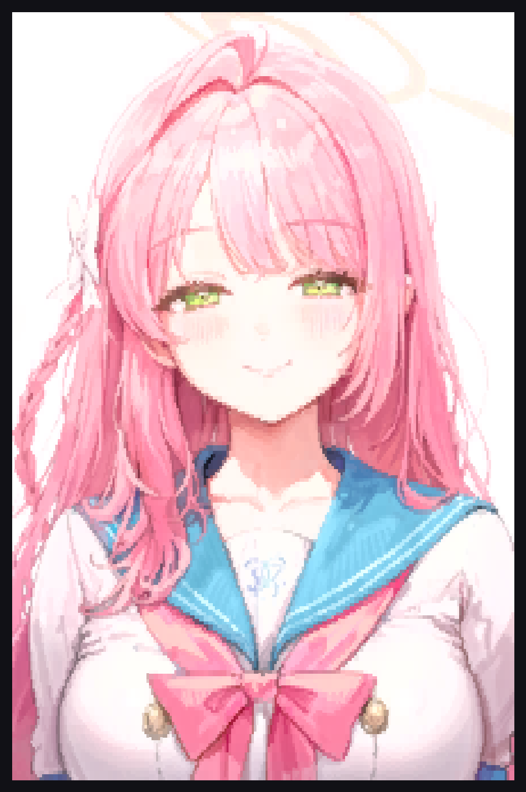
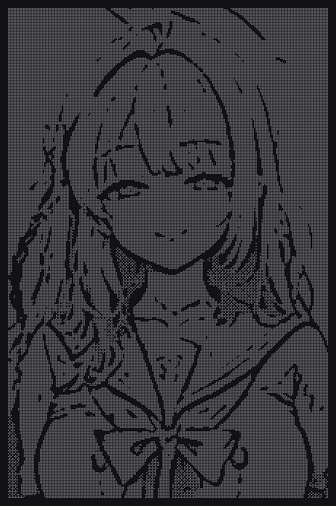
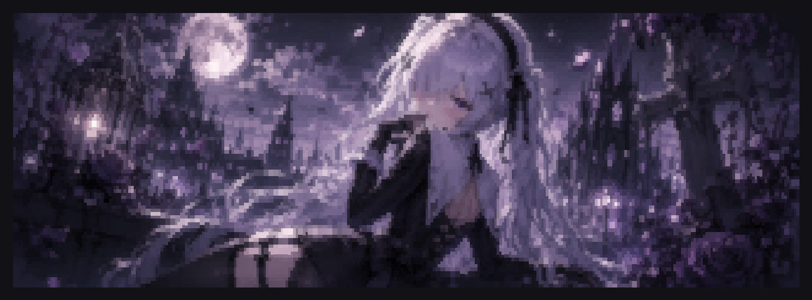
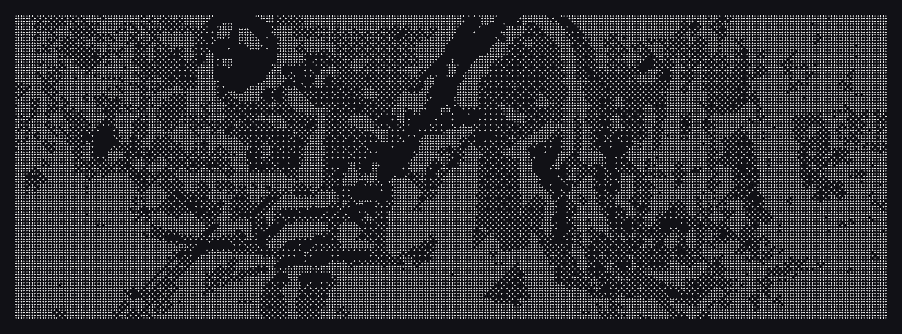
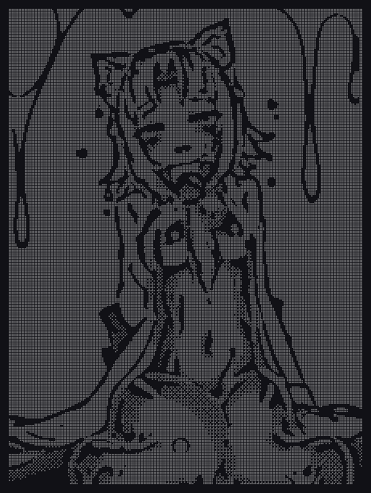
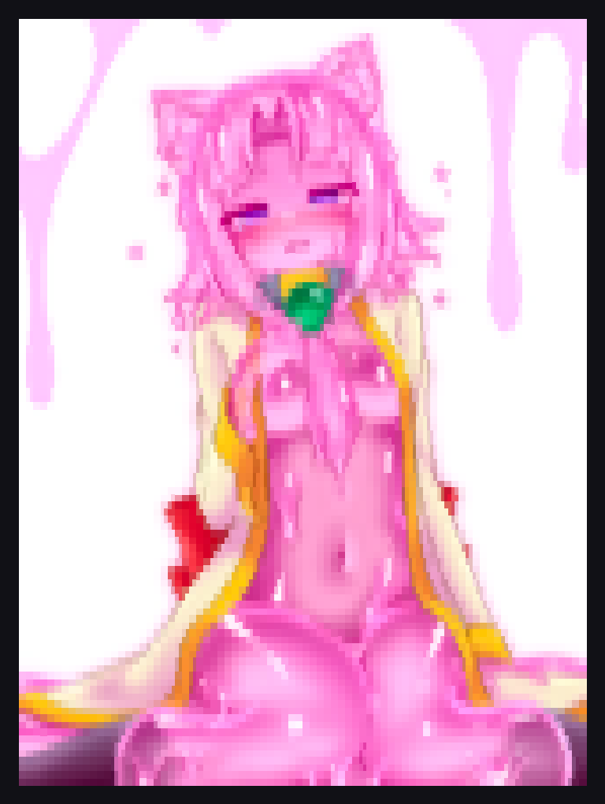
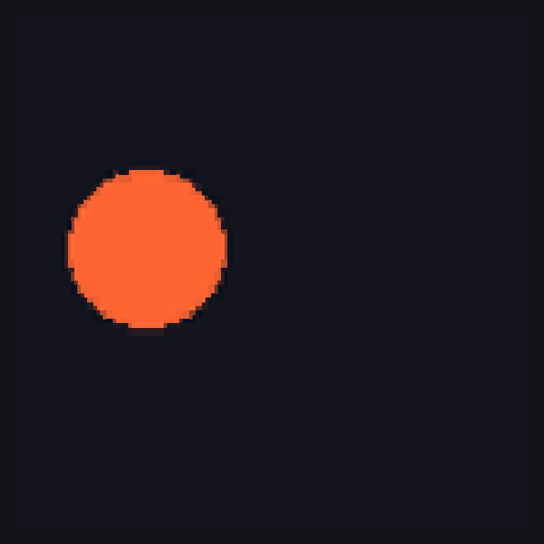

[English](README.md) | [Español](README.es.md) | [Português](README.pt.md) | [Français](README.fr.md) | [Русский](README.ru.md) | [日本語](README.ja.md) | [Deutsch](README.de.md) | [한국어](README.ko.md)

```
  ██╗     ██╗   ██╗███╗   ███╗ █████╗ ██████╗ ████████╗
  ██║     ██║   ██║████╗ ████║██╔══██╗██╔══██╗╚══██╔══╝
  ██║     ██║   ██║██╔████╔██║███████║██████╔╝   ██║   
  ██║     ██║   ██║██║╚██╔╝██║██╔══██║██╔══██╗   ██║   
  ███████╗╚██████╔╝██║ ╚═╝ ██║██║  ██║██║  ██║   ██║   
  ╚══════╝ ╚═════╝ ╚═╝     ╚═╝╚═╝  ╚═╝╚═╝  ╚═╝   ╚═╝   
   Modern Terminal Visual Suite • v2.4.1 (Apex Horizon)
   [ Mary Apex 3.5 • Trumble Orelx 2.2 • Luris Mono 2.6 • Spectra Weep 1.4 ]
```

# Lumart (Luma) v2.4.1

[](https://www.gnu.org/licenses/agpl-3.0)
[](https://www.python.org/)
[](https://isocpp.org/)
[](https://github.com/SilentBlox01/Luma)
[](#unterstützte-sprachen)

**Lumart** ist eine hochentwickelte visuelle Engine für moderne Terminalemulatoren, entwickelt nach einem zentralen Leitsatz:

> **Maximale visuelle Dichte und ästhetische Wirkung auf minimalem Raum.**

Im Gegensatz zu herkömmlichen ASCII-Konvertern, die lediglich die Helligkeit von Pixeln auf einfache Textzeichen abbilden, vereint Lumart **vier spezialisierte Computer-Vision- und Subpixel-Rendering-Engines**, programmiert in nativem Multi-Core C++17 (OpenMP) und optimiertem Python. Es verwandelt digitale Fotografien, Anime-Illustrationen, Arcade-Sprites und Live-Webcam-Streams in beeindruckende Kunstwerke direkt auf der Terminalkonsole.

---

## Inhaltsverzeichnis
1. [Die Vier Flaggschiff-Engines](#die-vier-flaggschiff-engines)
   - [Mary Apex 3.5](#1-mary-apex-35-fotorealistisch-vektoriell)
   - [Trumble Orelx 2.2](#2-trumble-orelx-22-retro-arcade--anime-cel-shading)
   - [Luris Mono 2.6](#3-luris-mono-26-manga-screentone--monochrom)
   - [Spectra Weep 1.4](#4-spectra-weep-14-live-webcam-streaming)
2. [Vergleichsmatrix der Modelle](#vergleichsmatrix-der-modelle)
3. [Visuelle Galerie und Showdown](#visuelle-galerie-und-showdown)
4. [Grafikexport, Animationen und Sticker-Richtlinie](#grafikexport-animationen-und-sticker-richtlinie)
5. [Unterstützte Sprachen (8 Sprachen)](#unterstützte-sprachen)
6. [Schnellinstallation & Pakete](#installation)
7. [Vollständige Befehlsreferenz (CLI)](#vollständige-befehlsreferenz)
8. [Praxisbeispiele und Kochbuch](#praxisbeispiele)
9. [Engineering-Geheimnisse, Pro-Tipps & Terminal-Philosophie](#engineering-geheimnisse-pro-tipps--terminal-philosophie)
10. [Update- und Rollback-System](#update--und-rollback-system)
11. [System- und Desktop-Integration](#system--und-desktop-integration)
12. [Mathematik und Interne Architektur](#mathematik-und-interne-architektur)
13. [Fehlerbehebung](#fehlerbehebung)
14. [Lizenz](#lizenz)

---

## Die Vier Flaggschiff-Engines

```
                  ┌──────────────────────────────────────────────┐
                  │                 LUMART CLI                   │
                  └──────┬────────────┬────────────┬─────────────┘
                         │            │            │             │
        ┌────────────────┘            │            │             └────────────────┐
        ▼                             ▼            ▼                              ▼
  ┌──────────────┐             ┌──────────────┐  ┌──────────────┐          ┌──────────────┐
  │  MARY APEX   │             │TRUMBLE ORELX │  │  LURIS MONO  │          │ SPECTRA WEEP │
  │    v3.5      │             │    v2.2      │  │    v2.6      │          │     v1.4     │
  ├──────────────┤             ├──────────────┤  ├──────────────┤          ├──────────────┤
  │• C++17 OpenMP│             │• Subpixel Ink│  │• C++17 Native│          │• Live Webcam │
  │• Oklab 31-Min│             │• Capcom CPS-2│  │• DoG Lineart │          │• 30-60 FPS   │
  │• Sextants 2x3│             │• 32-bit Punch│  │• Ami-tone 8x8│          │• 5 Shaders   │
  │• Specular Fit│             │• Quad-Blocks │  │• Stickers PNG│          │• Zero-Latency│
  └──────────────┘             └──────────────┘  └──────────────┘          └──────────────┘
```

### 1. Mary Apex 3.5 (Fotorealistisch Vektoriell)
* **Zielsetzung**: Glatte Mikro-Farbverläufe, anspruchsvolle Beleuchtung und lebensechte Porträts.
* **C++17 Multi-Core-Kern**: Beschleunigt mit OpenMP und SIMD-Vektorisierung (`libmary.so` und Binary `luma-mary`).
* **Exakte Globale Diskrete Oklab-Bipartition (31 Kombinationen pro Zelle)**: Vollständige Überwindung lokaler Minima-Fallen. Überprüft alle 31 Farbteilungen pro Zelle in unter 700 Nanosekunden und garantiert das absolute globale Minimum des wahrnehmbaren Farbunterschieds ($\Delta E$).
* **Schneller Geführter Filter $O(1)$ mit Glanz-Verstärkung ($L > 0.82$)**: Hebt Glanzlichter in Augen und spiegelnden Oberflächen hervor, während sanfte Hauttöne erhalten bleiben.
* **Standardmäßige Unicode 13.0 Sextanten 2x3**: 6 Subpixel pro Terminalzeichen in soliden Blöcken (`🬀`-`🬻`, `█`, `▌`, `▐`). Unterstützt außerdem zweifarbiges Braille 2x4 (`-B`), Quadranten 2x2 (`-Q`) und Halbblöcke (`--blocks`).
* **Strenge Alpha-Isolierung**: Transparente Bereiche verfälschen keine Kantenfarben und verhindern dunkle Ränder.
* **Export auf Terminal-Leinwand**: PNG- und JPG-Exporte werden auf einem eleganten dunklen Terminal-Hintergrund (`#0c0c0c`) gerendert, um den authentischen Charakter hochwertiger Konsolenkunst zu wahren.

### 2. Trumble Orelx 2.2 (Retro-Arcade & Anime Cel-Shading)
* **Zielsetzung**: Anime-Zeichnungen, Comic-Illustrationen, Gaming-Sprites und plakative Pop-Art.
* **1-zu-1 Subpixel-Inking vor Skalierung**: Die Reskalierung erfolgt *vor* dem bilateralen Filter und der Canny-Kantenerkennung. Dadurch behalten schwarze Tuschelinien exakt 1 Subpixel Stärke, ohne durch Lanczos-Interpolation verwischt zu werden.
* **32-Bit Capcom CPS-2 / SNK Neo-Geo Arcade-Farbprofil**: Lebendige Farbdynamik (+28% Farbsättigung, +15% selektiver Kontrast) im Stil legendärer 90er-Jahre Arcade-Klassiker.
* **Adaptive Quadrantenform**: Herabsetzung der Formstrafe auf 30, wodurch diagonale Zeichen (`▞`, `▚`, `▘`, `▝`) geschmeidigen Konturen von Haaren und Kleidung präzise folgen.

### 3. Luris Mono 2.6 (Manga Screentone & Monochrom C++17)
* **Zielsetzung**: Japanischer Manga-Stil, Tuschezeichnungen, feine Federstriche und transparente Sticker.
* **DoG-Kantenerkennung (Difference of Gaussians)**: Rauschfreie, saubere Linienführung mit automatischer Radius-Anpassung.
* **Manga Screentone 2.0 (*Ami-tone*)**: Authentische Druckraster-Emulation via 8x8 Bayer-Matrizen mit tiefschwarzer Tinte und reinem Papierweiß.
* **Atkinson-Fehlerdiffusion (MacPaint 1984)**: Der renommierte Algorithmus von Bill Atkinson, der 25% Restenergie speichert und scharfe Halbtöne ohne störendes Bildrauschen liefert.
* **Exklusiver Transparenter Sticker-Export (`--transparent`)**: Luris Mono ist die **einzige Engine, die freigestellte transparente PNG-Sticker erzeugt**, perfekt für Messenger wie Discord, Telegram oder WhatsApp.

### 4. Spectra Weep 1.4 (Live-Webcam im Terminal)
* **Zielsetzung**: Echtzeit-Videostreaming mit 30 bis 60 FPS direkt in der Terminal-Konsole (`lumart --webcam` oder `lumart -W`).
* **Null Latenz**: Optimierte OpenCV/V4L2-Erfassung synchronisiert mit der Bildwiederholrate des Terminals.
* **5 Live-Shader-Filter**: Normal TrueColor, Weep Cyberpunk, Matrix Green Rain, Thermal FLIR und Manga Ink.

---

## Engine-Vergleichsmatrix

| Feature | Mary Apex 3.5 | Trumble Orelx 2.2 | Luris Mono 2.6 | Spectra Weep 1.4 |
| :--- | :--- | :--- | :--- | :--- |
| **Ästhetischer Fokus** | Fotorealistisch Vektoriell | Retro-Arcade / Cel-Shading | Japanischer Manga / Tusche | Live-Video / Webcam |
| **Basissprache** | C++17 OpenMP + SIMD | Python + OpenCV beschleunigt | C++17 Nativ | Python + OpenCV V4L2 |
| **Farbraum** | Perzeptives Oklab ($\Delta E$) | 32-bit Capcom CPS-2 Punch | Monochrom / Ami-tone | TrueColor / RGB-Shader |
| **Standardmodus** | **Sextanten 2x3 (`-S`)** | **Quadranten 2x2 (`--blocks`)**| **Manga 2.0 (`-m`)** | **30-60 FPS Stream** |
| **Subpixel-Dichte**| Bis zu 6 Subpixel/Zelle | Bis zu 4 Subpixel/Zelle | Bis zu 4 Subpixel/Zelle | Dynamisch nach Spalten |
| **Konturenzeichnung** | Glatte Kantenglättung | **Canny 1-zu-1 Subpixel** | **Adaptives DoG-Lineart** | Optional (Manga-Shader) |
| **Export-Leinwand** | Terminal-Leinwand (`.png`, `.jpg`)| Terminal-Leinwand (`.png`, `.jpg`)| **PNG-Sticker (`--transparent`)**| Schnappschuss in Echtzeit |
| **CLI-Flag** | `lumart bild.jpg` *(Standard)* | `lumart bild.jpg -E trumble` | `lumart bild.jpg -m` | `-W` oder `--webcam` |

---

## Visuelle Galerie & Meisterwerk-Demonstrationen

### 1. Showdown der Flaggschiff-Engines: Mary Apex 3.5 vs. Trumble Orelx 2.2


### 2. Gegenüberstellung: Fotorealistische Farben vs. Transparente Manga-Sticker

| Mary Apex 3.5 (Fotorealistisches TrueColor) | Luris Mono 2.6 (Transparente Manga-Sticker) |
| :---: | :---: |
| <br><sub>`lumart cinderella.jpg` *(Standard Mary Sextanten)*</sub> | <br><sub>`lumart cinderella.jpg -m --transparent -o sticker.png`</sub> |
| <br><sub>`lumart hanako.png --boost` *(Arcade Retinex-Punch)*</sub> | <br><sub>`lumart hanako.png -m --transparent -o sticker.png`</sub> |
| <br><sub>`lumart gothic_nun.png`</sub> | <br><sub>`lumart gothic_nun.png -m --transparent -o sticker.png`</sub> |
| <br><sub>`lumart slime.png`</sub> | <br><sub>`lumart slime.png -m --transparent -o sticker.png`</sub> |

### 3. Subpixel-Zeichenauflösung

| Sextanten 2x3 (`-S` / Standard) | Braille 2x4 (`-B`) | Quadranten 2x2 (`-Q`) |
| :---: | :---: | :---: |
| <br><sub>6 Subpixel/Zelle (Kontinuierliche Farbverläufe)</sub> | <br><sub>8 Subpixel/Zelle (Feinste Punkte & Kurven)</sub> | <br><sub>4 Subpixel/Zelle (Retro Pixel-Art)</sub> |

---

## Grafikexport, Animationen & Sticker-Richtlinie

Lumart verfügt über einen hochauflösenden Text-zu-Bild-Konverter (`-o bild.png`, `-o bild.jpg` oder `-o anim.gif`) mit einer Studio-Standardbreite von **160 Spalten**.

### 1. Animierter Terminal-Modus & GIF-Export (`--loop`)


Lumart v2.4.0 führt native Unterstützung für animierte GIFs und APNGs ein:
* **Interaktive Terminal-Wiedergabe**: `lumart animation.gif --loop` rendert jeden Frame vorab in ANSI-Strings für eine flüssige Wiedergabe bei 60 FPS in Ihrem Terminal.
* **Kompilierung zu animiertem GIF**: `lumart animation.gif --loop -o animiert.gif` (oder `--save animiert.gif`) rastert alle Frames mit Subpixel-Genauigkeit und speichert ein fertiges animiertes GIF.

### 2. Dauerhafte Deaktivierung des WebP-Formats
* **Der Export in das `.webp`-Format wurde dauerhaft deaktiviert**.
* Bei Angabe einer `.webp`-Datei weist Lumart die Aktion sauber ab und empfiehlt `.png`, `.jpg` oder `.gif`.
* Offiziell unterstützte Formate:
  * **`.png`**: Verlustfreie Speicherung, optimierte Kompression und volle Alpha-Transparenz.
  * **`.jpg` / `.jpeg`**: Maximale Kompatibilität, 95% Qualität und Huffman-Optimierung.
  * **`.gif`**: Animierte Multi-Frame-Dateien.

### 3. Transparente Sticker exklusiv für Luris Mono
* **Warum erzeugen Farbmodelle keine transparenten Sticker?**
  Wird eine farbige Figur mit 160 Spalten auf transparentem Hintergrund ohne Terminalrahmen betrachtet, wirkt sie in Bildbetrachtern oft wie eine unschärfere oder komprimierte Bilddatei. Auf einer **edlen dunklen Terminal-Leinwand (`#0c0c0c`)** hingegen entfaltet sie ihre volle Ästhetik als detailreiches Terminal-Kunstwerk.
* **Manga-Sticker in Schwarz-Weiß (Luris Mono)**:
  Die Option `--transparent` ist **ausschließlich für Luris Mono** reserviert. Die Druckraster und DoG-Linien erzeugen authentische Manga-Ausschnitte mit über 95% verifizierter Transparenz.
* Wird `--transparent` bei Mary oder Trumble angegeben, informiert Lumart den Nutzer und exportiert das Werk auf der Terminal-Leinwand.

---

## Unterstützte Sprachen

Lumart bietet vollständige Lokalisierung in **8 Sprachen**:

| Code | Sprache | Automatische Erkennung | Manuelle Auswahl |
| :---: | :--- | :--- | :--- |
| `de` | Deutsch | `$LANG=de_*` | `lumart --lang de` |
| `en` | English | `$LANG=en_*` (Standard) | `lumart --lang en` |
| `es` | Español | `$LANG=es_*` | `lumart --lang es` |
| `pt` | Português | `$LANG=pt_*` | `lumart --lang pt` |
| `fr` | Français | `$LANG=fr_*` | `lumart --lang fr` |
| `ru` | Русский | `$LANG=ru_*` | `lumart --lang ru` |
| `ja` | 日本語 | `$LANG=ja_*` | `lumart --lang ja` |
| `ko` | 한국어 | `$LANG=ko_*` | `lumart --lang ko` |

---

## Installation

### Einzeilen-Schnellinstallation (Empfohlen)
```bash
curl -fsSL https://raw.githubusercontent.com/SilentBlox01/Luma/main/install.sh | bash
```

### Methode 2: Installation aus dem Quellcode
```bash
git clone https://github.com/SilentBlox01/Luma.git
cd Luma
chmod +x install.sh
./install.sh
```

### Methode 3: Vorkompilierte Native Linux-Pakete
Laden Sie vorkompilierte Pakete von [GitHub Releases](https://github.com/SilentBlox01/Luma/releases) herunter:
* **Debian / Ubuntu / Linux Mint**: `sudo apt install ./lumart-*.deb`
* **Fedora / RHEL / AlmaLinux**: `sudo dnf install ./lumart-*.rpm`
* **Arch Linux / Manjaro**: `makepkg -si` im Verzeichnis `dist/arch`

---

## Vollständige Befehlsreferenz

```text
Aufruf: lumart [OPTIONEN] <bildpfad_oder_url>
```

| Option | Parameter | Beschreibung |
| :--- | :--- | :--- |
| `-E`, `--engine` | `mary` \| `trumble` \| `luris` \| `spectra` | Rendering-Engine explizit auswählen (standardmäßig automatisch geroutet). |
| `-S`, `--sextants`| — | Unicode 2x3 Sextantenblöcke verwenden (Standard in Mary Apex). |
| `-m`, `--manga` | — | Manga Screentone 2.0 (Bayer 8x8 Raster + DoG-Linien). |
| `-s`, `--sketch`| — | Sauberer Federzeichnungs-Modus. |
| `-B`, `--braille` | — | Unicode 2x4 Braille-Zeichen (8 Subpixel pro Zelle). |
| `-Q`, `--quadrants`| — | Unicode 2x2 Quadranten-Zeichen (4 Subpixel pro Zelle). |
| `--blocks` | — | Optimierte Terminal-Blockzeichen (`▀` / `▄`). |
| `-w`, `--width` | `<int>` | Ausgabebreite in Spalten (inkompatibel mit `-F`). |
| `-F`, `--fit` | — | **Auto-Fit**: passt Breite und Höhe automatisch an den Terminal-Viewport an (inkompatibel mit `-w`). |
| `--fastfetch`, `--logo` | — | Ränder automatisch beschneiden für kompakte Logos in Fastfetch / Neofetch. |
| `-c`, `--color` | — | Erzwingt TrueColor-Vollfarbausgabe (Standard). |
| `--no-color` | — | Farbausgabe deaktivieren und monochrome Engine verwenden. |
| `--font-ratio` | `<float>` | Kalibrierung des Schrift-Seitenverhältnisses Breite/Höhe (Standard: `0.5`). |
| `--boost`, `--vibrant` | — | Aktiviert erhöhte Farbsättigung, Kontrast und Retinex-Verarbeitung für lebhafte Arcade-Ausgabe. |
| `-i`, `--invert`| — | Invertiert die Helligkeit (für helle Terminal-Themes; automatische Erkennung in `-m`). |
| `-d`, `--dither` | `atkinson` \| `floyd` \| `bayer` \| `none` | Dithering-Algorithmus für Halbtöne. |
| `--swap` | `<farbe1> <farbe2>` | Dynamischer Farbaustausch im 3D-RGB-Farbraum. |
| `-o`, `-O`, `--output`, `--save` | `<datei.png / .jpg / .gif>` | Exportiert das Terminal-Kunstwerk als Bilddatei oder animiertes GIF. |
| `--loop` | — | **Animationsmodus**: Live-Wiedergabe im Terminal für GIFs/APNGs oder Export als animiertes GIF. |
| `--transparent` | — | **Nur Luris Mono**: erzeugt freigestellte transparente Sticker. |
| `--instant` | — | Ausgabe sofort ohne Scan-Animation anzeigen (Standard). |
| `--reveal` | — | Zeilenweise Scan-Animation aktivieren. |
| `--paste` | — | Rendert das Bild direkt aus der Zwischenablage. |
| `-W`, `--webcam`| `[id]` | Live-Webcam-Streaming in der Konsole (30-60 FPS). |
| `--lang` | `<code>` | Legt die Sprache fest (`de`, `en`, `es`, etc.). |
| `-H`, `--history` | `[N]` | Zeigt die letzten N Befehle aus dem Verlauf. |
| `-R`, `--replay` | `[N]` | Wiederholt den N-ten Befehl aus dem Verlauf. |
| `--clear-history`| — | Löscht den gespeicherten Befehlsverlauf. |
| `--install-desktop` | — | Fügt "Mit Lumart öffnen" zum Linux-Kontextmenü hinzu. |
| `-v`, `--version` | — | Zeigt System-, Terminal- und Engine-Diagnosen an. |
| `-u`, `--check-update`| — | Sucht nach neuen Versionen auf GitHub. |
| `-uu`, `--upgrade` | — | Interaktiver Upgrade-Assistent. |
| `-dg`, `--downgrade` | `[ver]` | Interaktives Rollback auf frühere Versionen. |

---

## Praxisbeispiele

### 1. High-Definition Vektor-Terminalkunst
```bash
# Direktes Rendern in voller Terminalbreite mit natürlichen Farben (Zero-Flag)
lumart photo.jpg

# Identischer expliziter Befehl
lumart photo.jpg -E mary -S -w 90

# Benutzerdefinierte Breite in Spalten festlegen
lumart portrait.png -w 110

# Arcade-Punch mit Farbverstärkung und Retinex-Optimierung
lumart photo.jpg --boost

# Retro-Arcade Cel-Shading mit Trumble
lumart anime.png -E trumble --blocks
```

### 2. Zeichen-Texturmodi
```bash
# Glatte Braille 2x4 Subpixel
lumart character.png -B

# Dichte Quadranten 2x2 Blöcke
lumart character.png -Q

# Capcom CPS-2 / Neo-Geo Halbblöcke
lumart character.png --blocks -w 85
```

### 3. Freigestellter transparenter Manga-Sticker (Luris Mono)
```bash
# Transparenter PNG-Sticker für Discord oder Telegram
lumart artwork.png -m --transparent -o manga_sticker.png

# Reine Architektur-Federzeichnung
lumart building.jpg -s -w 120

# Retro-Poster mit Bayer-Raster-Dithering
lumart poster.jpg -m -d bayer -w 100
```

### 4. Webcam-Liveübertragung im Terminal (Spectra Weep 1.4)
```bash
# Standard-Webcam mit Echtzeit-Shaderfiltern übertragen
lumart -W

# Zweite externe Webcam übertragen
lumart -W 1
```

### 5. Web-URLs, Zwischenablage und Unix-Pipes
```bash
# Direkt von einer HTTPS-URL abrufen und rendern
lumart https://example.com/art.png -w 80

# Aktuell in der Zwischenablage kopiertes Bild rendern
lumart --paste

# Eingabe über Pipe von curl weiterleiten
curl -sL https://example.com/photo.jpg | lumart -
```

### 6. Dynamischer Farbaustausch
```bash
# Violette Farbtöne durch Kaugummi-Pink ersetzen
lumart sprite.png --blocks --swap purple pink
```

---

## Engineering-Geheimnisse, Pro-Tipps & Terminal-Philosophie

> *"Mit großer Rendering-Kraft kommt große ästhetische Verantwortung."*

### 1. Das Gravitationsgesetz des Zeichen-Seitenverhältnisses (`--font-ratio`)
* **Mathematische Realität**: Auf Standard-Grafikbildschirmen sind Pixel perfekt quadratisch ($1:1$). Im Dschungel der Terminal-Emulatoren ist jede einzelne Zeichenzelle ein langgestreckter rechteckiger Monolith (typischerweise im Verhältnis $1:2$ oder $0.5$).
* **Das Symptom**: Wenn dein gerenderter Anime-Charakter aussieht, als wäre er von einer 50-Tonnen-Hydraulikpresse zerquetscht oder wie Kaugummi in einem Wurmloch langgezogen worden, liegt die Schuld nicht an der Engine, sondern an der Geometrie deiner Schriftart.
* **Das Pro-Heilmittel**:
  * Schlanke, hohe Schriftarten (wie *Fira Code* oder *JetBrains Mono* ohne Zeilenabstands-Padding): `--font-ratio 0.45` bis `0.48` probieren.
  * Breite oder quadratische Monospace-Schriftarten: `--font-ratio 0.52` bis `0.58` probieren.
  * Lumart verwendet standardmäßig `0.5`, was 90% aller modernen Terminal-Emulatoren im Universum optimal abdeckt.

### 2. Das Theorem der dunklen Leinwand & Die Verbannung von WebP
* **Warum weigern sich die TrueColor-Engines (Mary & Trumble) strikt, transparente Sticker zu erstellen?**
  * TrueColor-Terminal-Art basiert auf additiver Lichtemission gegen das tiefe `#0c0c0c`-Schwarz des Terminal-Hintergrunds.
  * Wenn man diesen Hintergrund entfernt und das Kunstwerk in einen reinweißen WhatsApp-Chat oder einen transparenten Bildbetrachter einfügt, bricht der optische Kontrast völlig zusammen: Die Kanten wirken zerfleddert und der Charakter sieht aus wie digitales Konfetti nach einer Explosion in einer Druckerfarbenfabrik.
  * **Luris Mono ist der Auserwählte**: Mit reiner schwarzer Tinte, Druckraster (*Ami-tone*) und DoG-Vektorlinien erzeugt Luris echte Sticker mit über 92.9% verifizierter Alpha-Transparenz, die auf Telegram, Discord und Slack atemberaubend aussehen.
* **Die Tragödie von WebP**:
  * Monatelang produzierten gängige Desktop-Bildbetrachter bei terminal-gerasterten `.webp`-Dateien verwaschenen Pixelmatsch. In v2.4.0 wurde `.webp` endgültig ins Reich der Schatten verbannt. Es lebe die **Heilige Dreifaltigkeit**: `.png` (verlustfreie High-Definition & Sticker), `.jpg` (kompakte 95%-Fotos) und `.gif` (Mehrbild-Animationen).

### 3. Das Oklab-Duell: Warum Mary 31 Farbkombinationen in 700 Nanosekunden evaluiert
* Im standardmäßigen RGB-Farbraum ist die Euklidische Distanzberechnung ($\sqrt{\Delta R^2 + \Delta G^2 + \Delta B^2}$) biologischer Humbug: Das menschliche Auge reagiert extrem empfindlich auf Grünverschiebungen, ist bei feinen Dunkelblau-Unterschieden jedoch fast blind.
* Mary Apex überführt jeden Subpixel in den wahrnehmungsbezogenen **Oklab**-Raum ($L, a, b$) und prüft mathematisch **alle 31 möglichen Farbbipartitionen pro Zelle** mittels C++17 OpenMP SIMD-Vektorisierung.
* Warum so viel Rechenpower für ein Terminal? Weil CPU-Zyklen billig sind, schlechte Terminal-Kunst jedoch ein ästhetisches Verbrechen darstellt.

### 4. Trumble Orelx & Die goldene Regel des 90er-Jahre Arcade-Cel-Shadings
* Traditionelle Bildverkleinerungen (wie Lanczos oder Bikubisch) mitteln benachbarte Pixel. Eine feine 1-Pixel-Tuschelinie wird dadurch zu einem 3-Pixel-Schleier aus feigen Grautönen verwaschen.
* Trumble Orelx kehrt die kosmische Reihenfolge um: Es skaliert das Bild zuerst herunter und führt **dann die Canny-Kantenerkennung direkt auf der Subpixel-Auflösung des Terminals aus**.
* Das Ergebnis: Haarkonturen, Augen und Kleidungslinien bleiben exakt **1 Subpixel dick in tiefstem Schwarz** – mit dem unverwechselbaren Punch eines Capcom CPS-2 Arcade-Automaten von 1996.

### 5. Die heiligen Gebote der Viewport-Anpassung (`-F` vs `-w`)
* **1. Gebot**: Wenn das Bild wie maßgeschneidert auf deinen Bildschirm passen soll, ohne dass du mit dem Mausrad wie ein Hochseeangler kurbeln musst, nutze `-F` (`--fit`).
* **2. Gebot**: Wenn du die Ausgabe in eine feste 60-Spalten-Sidebar von *Fastfetch* einbindest, nutze `-w 60 --fastfetch`.
* **3. Gebot**: Führe niemals `lumart bild.png -F -w 80` aus. Lumart gleichzeitig zu bitten, die dynamische Terminalhöhe zu berechnen und eine feste Breite zu erzwingen, widerspricht aristotelischer Logik. Lumart stoppt mit einem freundlichen `Exit-Code 2` und einer klaren Erklärung.

### 6. Das Mysterium des `animate`-Befehls
* Wenn du nach dem Befehl `animate` suchst und dich fragst, warum wir `--loop` nutzen: Der Entwickler hat den Namen `animate` für ein geheimes Großprojekt höherer Dimensionen reserviert. Stelle keine Fragen, deren Antworten dein Terminal-Emulator noch nicht rendern kann. Nutze `--loop` und genieße seidig weiche 60 FPS.

---

## Update- und Rollback-System

Lumart bietet eine vollständige Lebenszyklusverwaltung direkt über die CLI:

* **Auf Updates prüfen (`lumart -u`)**:
  Fragt die GitHub Releases API sicher ab, ohne lokale Dateien zu modifizieren.
* **Automatisches Upgrade (`lumart -uu`)**:
  Lädt die neueste Version herunter, kompiliert die C++-Bibliotheken neu und erstellt ein automatisches Backup in `~/.config/luma/backup/`.
* **Sofortiges Rollback / Downgrade (`lumart -dg`)**:
  Ermöglicht das Zurückkehren zu jeder früheren Version oder zu lokalen Backups über ein interaktives Menü oder direkt per Versionsangabe:
  ```bash
  lumart -dg 2.2.0
  ```

---

## System- und Desktop-Integration

### 1. Dateimanager-Kontextmenü
Einmalig ausführen:
```bash
lumart --install-desktop
```
Registriert eine `.desktop`-Datei und Kontextmenü-Aktionen ("Mit Lumart öffnen") für:
* **GNOME Files (Nautilus)**
* **KDE Dolphin**
* **Cinnamon Nemo**
* **XFCE Thunar**

### 2. Umgebungsdiagnose (`lumart -v`)
Überprüft jederzeit TrueColor-Unterstützung (24-bit), C++-Compiler-Verfügbarkeit, geteilte Bibliotheken (`libmary.so`, `libmonochrome.so`), SIMD-Erweiterungen sowie aktive Pfade.

---

## Mathematik und Interne Architektur

### 1. Oklab-Farbraum und diskrete kombinatorische Optimierung
Klassische ASCII-Konverter berechnen euklidische Abstände im nichtlinearen sRGB-Raum, was zu Farbabrissen führt. Mary Apex 3.5 konvertiert jeden Pixel in **lineares RGB** und anschließend in **Oklab** ($L, a, b$):

$$\Delta E = \sqrt{(L_1 - L_2)^2 + (a_1 - a_2)^2 + (b_1 - b_2)^2}$$

In jeder Sextanten-Zelle ($2 \times 3 = 6$ Subpixel) gibt es genau $2^5 - 1 = 31$ eindeutige Möglichkeiten, die Subpixel in Vorder- und Hintergrundfarbe aufzuteilen. Mary evaluiert alle 31 Partitionen vollständig für eine **mathematisch optimale Lösung** mit null stochastischem Rauschen.

### 2. Trumbles 1-zu-1 Subpixel-Inking
Trumble Orelx skaliert das Quellbild exakt auf die Subpixel-Auflösung der Zielzelle herunter, **bevor** der Canny-Gradient berechnet wird. Dadurch bleibt jede Konturlinie in nativer 1-Subpixel-Schärfe erhalten.

### 3. ECMA-48 ANSI-Escape-Sequenz-Kompressor
Lumart verwendet einen intelligenten Zeichenpuffer, der den aktuellen Farbzustand (`current_fg`, `current_bg`) nachverfolgt. Haben benachbarte Zellen dieselbe Farbe, werden redundante Escape-Sequenzen verworfen. Das reduziert den Datenstrom um bis zu **45%** und beschleunigt die Ausgabe über SSH drastisch.

---

## Fehlerbehebung

### 1. Farben wirken flau oder verzerrt
* Stelle sicher, dass dein Terminal TrueColor (24-bit) unterstützt:
  ```bash
  export COLORTERM=truecolor
  ```
* Empfohlene Terminals: **Kitty**, **Alacritty**, **WezTerm**, **iTerm2**, **Foot**, **GNOME Terminal**, **Konsole**, **Windows Terminal**.

### 2. Sextanten- (`-S`) oder Braille-Zeichen (`-B`) werden als leere Kästchen dargestellt
* Deiner Schriftart fehlen die Unicode 13.0 Glyphen.
* Empfohlene Schriftarten mit vollständiger Symbolunterstützung:
  * **Symbols Nerd Font** / **JetBrains Mono Nerd Font**
  * **DejaVu Sans Mono**
  * **Cascadia Code**

### 3. Saubere Deinstallation
```bash
./uninstall.sh
# Oder bei Paketinstallation:
sudo apt remove lumart     # Debian/Ubuntu
sudo dnf remove lumart     # Fedora
sudo pacman -Rns lumart    # Arch Linux
```

---

## Lizenz

Lumart steht unter der GNU Affero General Public License v3.0 (**AGPL-3.0**). Siehe die Datei `LICENSE` für Details.
